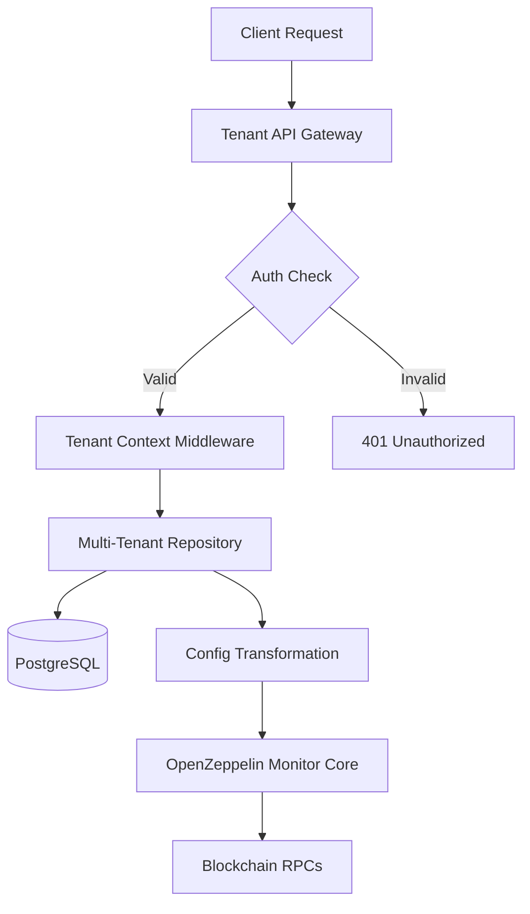
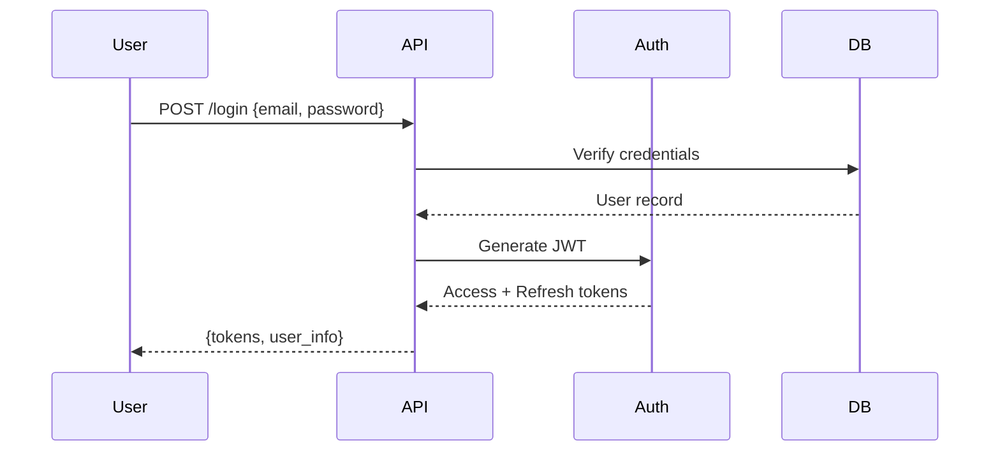

# Architecture Deep Dive

## How It Works Without Modifying OpenZeppelin Monitor

The Stellar Monitor Tenant Isolation Engine acts as a wrapper layer around OpenZeppelin Monitor, intercepting configuration requests and providing tenant-isolated data storage.

### Integration Pattern



### Key Components

#### 1. Configuration Transformation Layer

Instead of reading from JSON files, our repositories transform database records into OpenZeppelin Monitor's expected format:

```rust
// Multi-tenant repository fetches from database
let tenant_monitor = tenant_monitor_repo.get("monitor-123").await?;

// Transform to OZ Monitor format
let oz_monitor = Monitor {
    name: tenant_monitor.monitor_id.clone(),
    networks: vec![tenant_monitor.network_id],
    configuration: serde_json::from_value(tenant_monitor.configuration)?,
    // ... other fields
};

// Pass to OZ Monitor's services
monitor_service.process(oz_monitor).await?;
```

#### 2. Service Wrapper Pattern

Each OZ Monitor service gets a tenant-aware wrapper:

```rust
pub struct TenantAwareMonitorService<M: MonitorService> {
    inner: M,
    tenant_repo: TenantMonitorRepository,
}

impl<M: MonitorService> TenantAwareMonitorService<M> {
    pub async fn get_monitor(&self, monitor_id: &str) -> Result<Monitor> {
        // Get tenant-specific monitor from database
        let tenant_monitor = self.tenant_repo.get(monitor_id).await?;
        
        // Transform and delegate to inner service
        let oz_monitor = transform_to_oz_format(tenant_monitor);
        self.inner.process(oz_monitor).await
    }
}
```

#### 3. Resource Quota Enforcement

Before any operation, quotas are checked:

```rust
pub async fn create_monitor(&self, request: CreateMonitorRequest) -> Result<Monitor> {
    // Check quota
    let quota_status = self.tenant_repo.get_quota_status().await?;
    if !quota_status.can_create_monitor() {
        return Err(QuotaExceeded("Monitor limit reached"));
    }
    
    // Check RPC capacity
    if !quota_status.has_rpc_capacity(estimated_rpc_usage) {
        return Err(QuotaExceeded("RPC limit would be exceeded"));
    }
    
    // Proceed with creation
    self.create_monitor_internal(request).await
}
```

#### 4. Tenant Context Propagation

Using Tokio's task-local storage ensures tenant isolation throughout the request:

```rust
task_local! {
    static TENANT_CONTEXT: Arc<TenantContext>;
}

// In middleware
let context = TenantContext::new(tenant_id);
TENANT_CONTEXT.scope(Arc::new(context), async {
    // All code in this scope has access to tenant context
    next.run(request).await
}).await
```

### Database Design Decisions

#### Why Database Over Files?

1. **Atomic Operations**: Database transactions ensure consistency
2. **Concurrent Access**: Multiple instances can safely read/write
3. **Query Flexibility**: Filter by tenant, search, aggregate
4. **Audit Trail**: Built-in history and change tracking
5. **Backup/Restore**: Standard database backup procedures

#### Schema Design Principles

1. **Tenant ID in Every Table**: Ensures complete isolation
2. **UUID Primary Keys**: Globally unique, no collisions
3. **JSONB for Configs**: Flexibility for OZ Monitor config evolution
4. **Soft Deletes**: `is_active` flag preserves history
5. **Automatic Timestamps**: `created_at`, `updated_at` on all tables

### Performance Optimizations

#### 1. Connection Pooling

```rust
// Per-tenant connection pools prevent noisy neighbor issues
let pool = PgPoolOptions::new()
    .max_connections(calculate_pool_size(tenant.max_rpc_requests_per_minute))
    .connect(&database_url)
    .await?;
```

#### 2. Caching Strategy

```rust
// Cache frequently accessed configs
pub struct CachedMonitorRepository {
    inner: TenantMonitorRepository,
    cache: Arc<RwLock<HashMap<String, (Monitor, Instant)>>>,
    ttl: Duration,
}
```

#### 3. Query Optimization

- Composite indexes on (tenant_id, resource_id)
- Partial indexes for active resources
- Materialized views for usage statistics

### Security Architecture

#### 1. Authentication Flow



#### 2. Authorization Model

- **Owner**: Full tenant management
- **Admin**: Manage resources, not billing
- **Member**: Create/modify monitors
- **Viewer**: Read-only access

#### 3. API Key Scoping

```json
{
  "permissions": [
    {
      "resource": "monitors",
      "actions": ["read", "write"]
    },
    {
      "resource": "networks",
      "actions": ["read"]
    }
  ]
}
```

### Deployment Architecture

#### 1. Kubernetes Deployment

```yaml
apiVersion: apps/v1
kind: Deployment
metadata:
  name: stellar-monitor-tenant
spec:
  replicas: 3
  template:
    spec:
      containers:
      - name: api
        resources:
          requests:
            memory: "512Mi"
            cpu: "500m"
          limits:
            memory: "1Gi"
            cpu: "1000m"
```

#### 2. Horizontal Scaling

- Stateless API servers scale horizontally
- Database connection pooling prevents overload
- Redis for distributed caching
- RabbitMQ for async job processing

### Migration Path

For existing OpenZeppelin Monitor users:

1. **Export Current Configs**: Script to export JSON configs
2. **Import to Database**: Bulk import with tenant assignment
3. **Gradual Migration**: Run both systems in parallel
4. **Cutover**: Switch to multi-tenant system

### Future Enhancements

1. **GraphQL API**: More flexible querying
2. **WebSocket Subscriptions**: Real-time updates
3. **Blockchain Indexing**: Shared indexing infrastructure
4. **Cost Attribution**: Per-tenant resource usage billing
5. **Federation**: Cross-tenant monitor sharing
